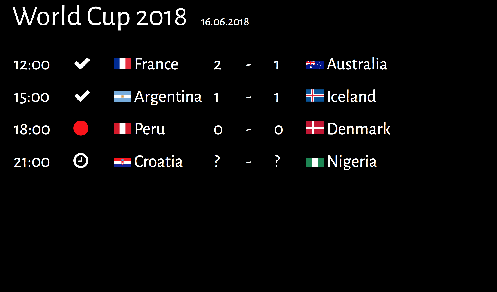

# mirrOS World Cup 2018 Module

Das World Cup 2018-Modul zeigt die Spiele des aktuellen Spieltags an.

## Voraussetzungen

* football-data.org API Key ([Get API Key](https://www.football-data.org/client/register))
* Raspberry mit installiertem [mirrOS](https://glancr.de/mirr-os/)

## Download

Du kannst dir [hier](https://glancr.de/module/unterhaltung/worldcup18/) die neuste Version des Moduls herunterladen.  
Die Modul-Updates werden direkt via mirrOS-Backend installiert.

## Das Modul in Aktion

## Weitere Informationen
* [football-data.org](https://www.football-data.org)
* [World Cup 18-Modul](https://glancr.de/module/unterhaltung/worldcup18/)
* [Glancr](https://glancr.de)
* [mirrOS](https://glancr.de/#mirr_os)

## Andere Module

Besuche meine Entwicklerseite und schau dir meine anderen Module an: 
[Marco Roth auf glancr.de](https://glancr.de/entwickler/marco-roth/)
